# Avatars

La lista dei personaggi da creare è la seguente.

## Sicuri (in ordine di apparizione)

- [Raffaello](./raffaello/)

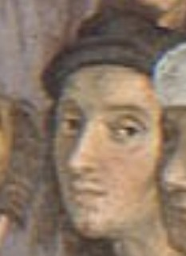

- Pitagora

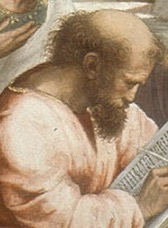

- Platone/Leonardo

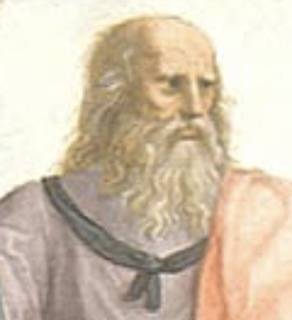

- Apollodoro

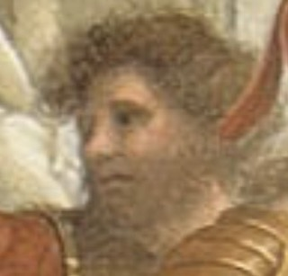

- un sofista

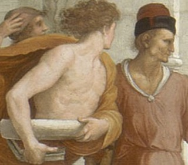

- Socrate

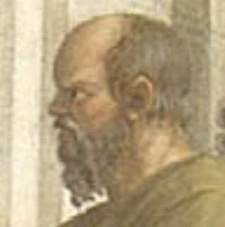

- Alcibiade

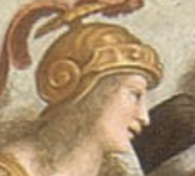

- Tolomeo

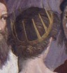

- Zoroastro

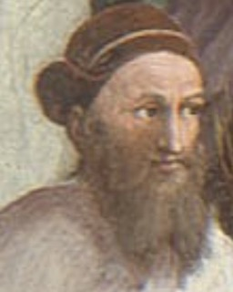

- Aristotele

- Eraclito/Michelangelo

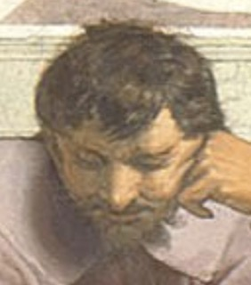

- Diogene

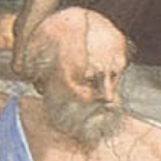

## Altri (in forse)

- Euclide/Bramante

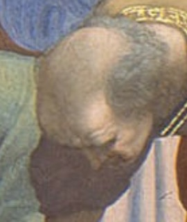

- Ipazia/Kalokagathia (Francesco Maria della Rovere)

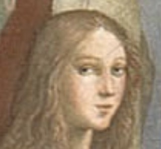

- Speusippo

- Plotino

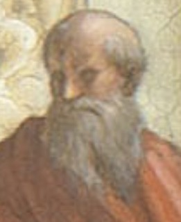

- Federico II Gonzaga

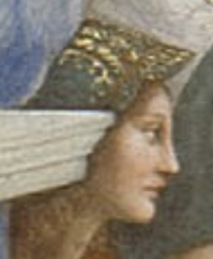
