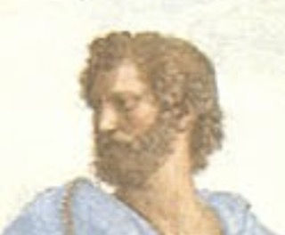

# Avatars

L'affresco di Raffaello contiene molti personaggi, ma non tutti verranno realizzati per questa esperienza.

Abbiamo diviso i personaggi in tre gruppi:

- personaggi da animare, che avranno interazione con l'utente
- personaggi che compariranno staticamente, per riempire in parte la scena in alcuni momenti, ma che non saranno animati e con cui non si potrà interagire
- personaggi che non verranno realizzati e non appariranno nell'esperienza, nemmeno in forma statica.

Per un profilo psicologico dei personaggi, vedi [qui](https://docs.google.com/document/d/1tLdUelrPEVQl-0wOlEBefrZkOMdlkQCOvDhMUF2EG8Y/edit?usp=sharing). Il profilo dei personaggi è necessario per la realizzazione del doppiaggio e per la scelta delle animazioni.

## Personaggi animati in ordine di apparizione

- [Raffaello](./raffaello/)

- [Platone/Leonardo](./platone/)

- [Ipazia/Kalokagathia (Francesco Maria della Rovere)](./ipazia/)

- [Federico II Gonzaga](./gonzaga/)

- Pitagora

- Apollodoro

- un sofista

- Socrate

- Alcibiade

- Tolomeo

- Zoroastro

- Aristotele

- Eraclito/Michelangelo

- Diogene

## Altri personaggi da confermare se animare o statici

- Euclide/Bramante

- Speusippo

- Plotino

## Personaggi statici

TODO
