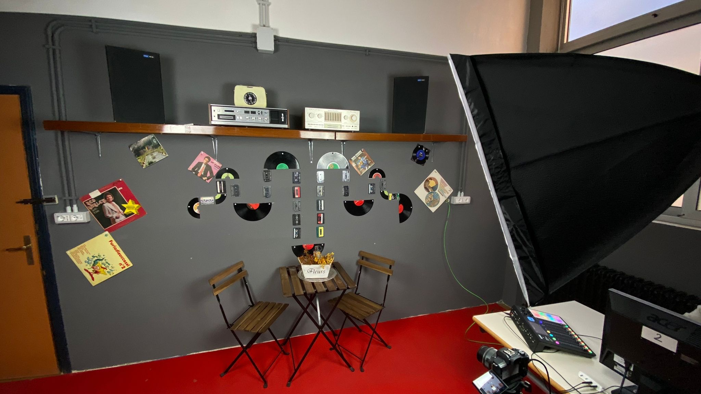

# Doppiaggio

La nostra scuola ha una sala radio attrezzata con il necessario per registrazioni audio di buona qualità. In questa sala trasmettono settimanalmente "Radio Marconi Europa", la radio della nostra scuola.

La sala è gestita da studenti che hanno studiato dizione e recitazione e ci stanno aiutando a selezionare ed impostare correttamente le voci dei diversi personaggi. In particolare ringraziamo Riccardo Frontoni del 5Cinf 2023/24.

Uno dei requisiti di questo progetto è supportare almeno le seguenti lingue:

- italiano
- inglese

Abbiamo inoltre nella nostra scuola le competenze e, qualora necessario, possiamo realizzare anche le seguenti lingue:

- cinese
- tedesco
- spagnolo
