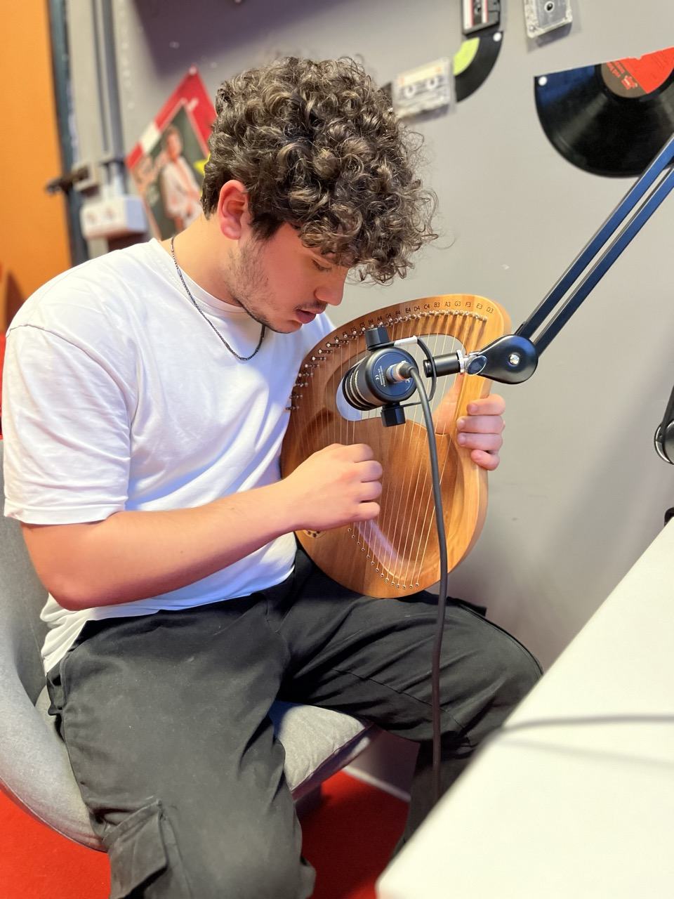

# Musica

## Primo capitolo

Per il primo capitolo, abbiamo scelto di usare la lira (arpa da giro) come strumento principale della colonna sonora, in coerenza con il tema del capitolo.

Le melodie sono scritte ed interpretate da Riccardo Rizzo, studente del 5Bsa (2023/24) con lo strumento reale acquistato per il progetto ([arpa a lira 24 corde](https://mepazone.com/p/ECF37Q2O)).

[Qui](https://drive.google.com/file/d/1Xsrp9SemfkcGzESITcSfOgv9J0D2qAxd/view?usp=sharing) una prima prova di registrazione.

