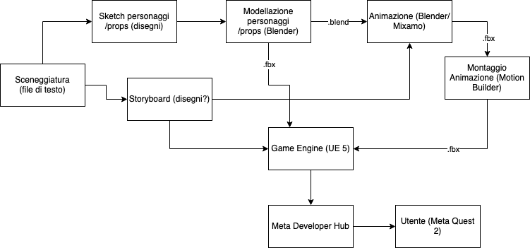

# Workflow

Di seguito un diagramma in cui illustriamo il workshop seguito dal progetto.

La gestione del progetto (assegnazione dei task, avanzamento, etc.) avviene tramite GitHub e GitHub Project.

